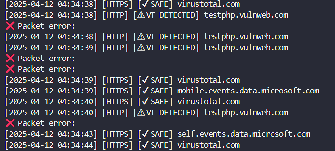
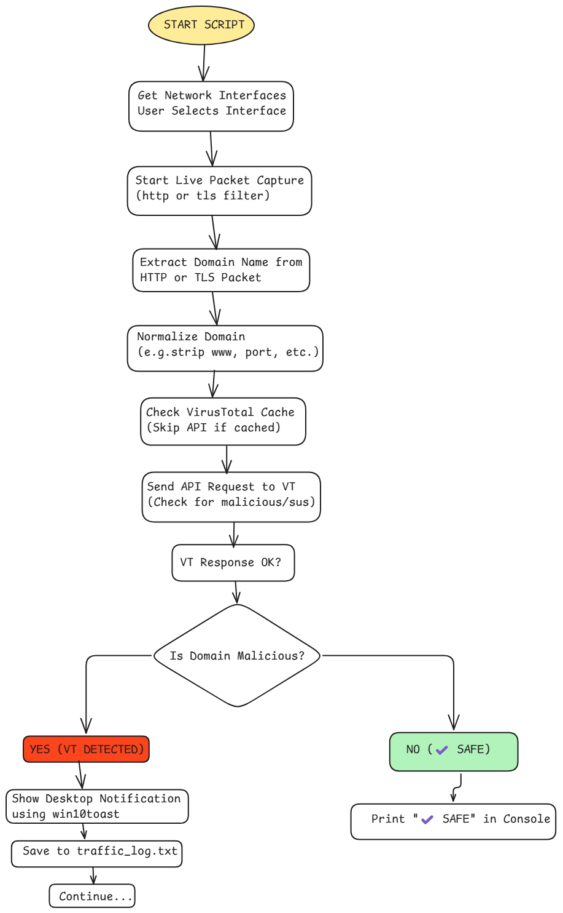

# 🛡️ HTTP/HTTPS Network Threat Monitor with VirusTotal

This Python-based tool monitors live network traffic over HTTP/HTTPS and alerts you if any visited domains are flagged as **malicious by VirusTotal**.

## 🔧 Features
- Real-time HTTP/HTTPS monitoring
- VirusTotal API integration
- Desktop pop-up notifications for threats
- Logs all traffic in `traffic_log.txt`

## 🚀 Setup
- Clone this repo
- pip install -r requirements.txt

## 🗝️ VirusTotal API Key
- Create an account at https://virustotal.com
- Go to your profile > API Key
-Replace "YOUR_VIRUSTOTAL_API_KEY" with your API in alert_system.py

## 🚀 Run the Tool
- python alert_system.py
- Select your network interface no.
- Go to web browser and start surfing web like google.com, myntra.com, test.php(for http)....etc.

## How to Identify Your Active Network Interface??
- ✅ Open Command Prompt / PowerShell

- Type the following command and press Enter:
-      getmac /v /fo list
- Look for the entry where Connection Name is something like "Wi-Fi", "Wireless Network Connection", or "Ethernet".

- You’ll see a Transport Name like:
\Device\NPF_{D293B4A3-61C1-4F6F-8C3A-B748D01984A1}
Match that NPF_{...} Transport Name to the list shown in your script.

-Just enter the correct number when prompted:
👉 Enter the interface number to monitor:
For example, if “Wi-Fi” corresponds to 3. \Device\NPF_{ZZZZ}, just type 3 and hit Enter.

## Expected Output:

## Workflow Diagram 

## For Queries
- mail => aatifmdalam@gmail.com