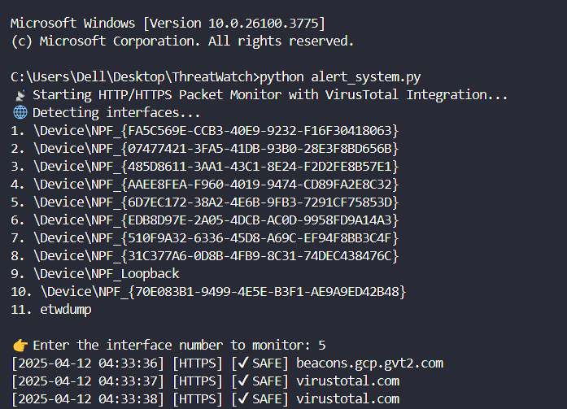

# 🛡️ HTTP/HTTPS Network Threat Monitor with VirusTotal

This Python-based tool monitors live network traffic over HTTP/HTTPS and alerts you if any visited domains are flagged as **malicious by VirusTotal**.

## 🔧 Features
- Real-time HTTP/HTTPS monitoring
- VirusTotal API integration
- Desktop pop-up notifications for threats
- Logs all traffic in `traffic_log.txt`

## 🚀 Setup
- Clone this repo
- pip install -r requirements.txt

## 🗝️ VirusTotal API Key
- Create an account at https://virustotal.com
- Go to your profile > API Key
-Replace "YOUR_VIRUSTOTAL_API_KEY" with your API in alert_system.py

## 🚀 Run the Tool
- python alert_system.py
- Select your network interface when prompted. 

## How to Identify Your Active Network Interface??
- ✅ Open Command Prompt / PowerShell

- Type the following command and press Enter:
-      getmac /v /fo list
- Look for the entry where Connection Name is something like "Wi-Fi", "Wireless Network Connection", or "Ethernet".

- You’ll see a Transport Name like:
\Device\NPF_{D293B4A3-61C1-4F6F-8C3A-B748D01984A1}
Match that NPF_{...} Transport Name to the list shown in your script.

-Just enter the correct number when prompted:
👉 Enter the interface number to monitor:
For example, if “Wi-Fi” corresponds to 3. \Device\NPF_{ZZZZ}, just type 3 and hit Enter.

## Expected Output:

## Workflow Diagram 
┌────────────────────────────┐
│        START SCRIPT        │
└────────────┬───────────────┘
             │
             ▼
┌────────────────────────────┐
│  Get Network Interfaces    │
│  User Selects Interface    │
└────────────┬───────────────┘
             │
             ▼
┌────────────────────────────┐
│  Start Live Packet Capture │
│   (http or tls filter)     │
└────────────┬───────────────┘
             │
             ▼
┌────────────────────────────┐
│  Extract Domain Name from  │
│   HTTP or TLS Packet       │
└────────────┬───────────────┘
             │
             ▼
┌────────────────────────────┐
│ Normalize Domain (e.g.     │
│ strip www, port, etc.)     │
└────────────┬───────────────┘
             │
             ▼
┌────────────────────────────┐
│  Check VirusTotal Cache    │
│  (Skip API if cached)      │
└────────────┬───────────────┘
             │
             ▼
┌────────────────────────────┐
│   Send API Request to VT   │
│   (Check for malicious/sus)│
└────────────┬───────────────┘
             │
     ┌───────▼────────┐
     │ VT Response OK?│
     └───────┬────────┘
             │
     ┌───────▼────────----┐
     │Is Domain Malicious?│-----------------------
     └───────┬────────----┘                      |
     ┌───────▼──────────────┐        ┌────────────────────────────┐
     │YES (VT DETECTED)     │        │     NO (✔ SAFE)            │
     └────────┬─────────────┘        └────────────┬───────────────┘
              │                                   │
              ▼                                   ▼
   ┌────────────────────────────┐      ┌────────────────────────────┐
   │ Show Desktop Notification  │      │  Print "✔ SAFE" in Console │
   │      using win10toast      │      └────────────────────────────┘
   └────────────┬───────────────┘
                ▼
   ┌────────────────────────────┐
   │   Save to traffic_log.txt  │
   └────────────────────────────┘
                │
                ▼
        ┌──────────────┐
        │ Continue...  │
        └──────────────┘

## For Queries
- mail => aatifmdalam@gmail.com